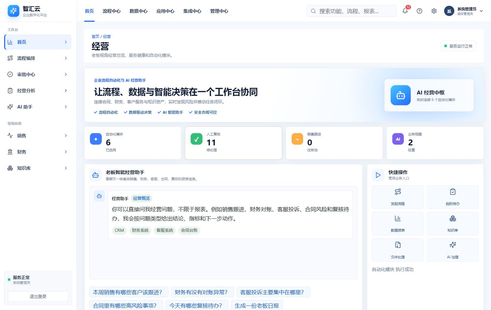
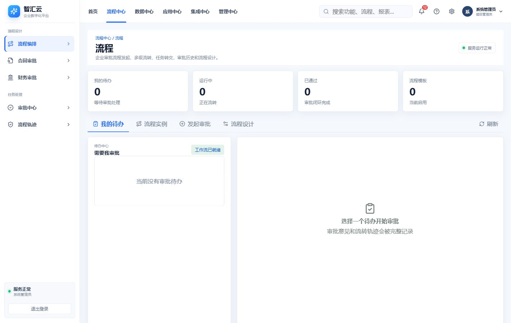
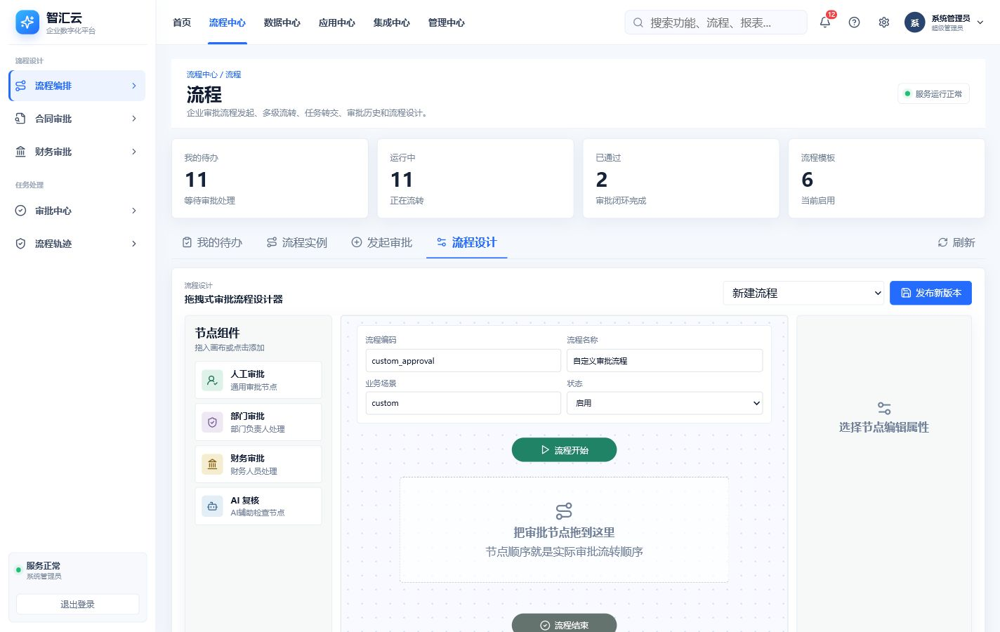
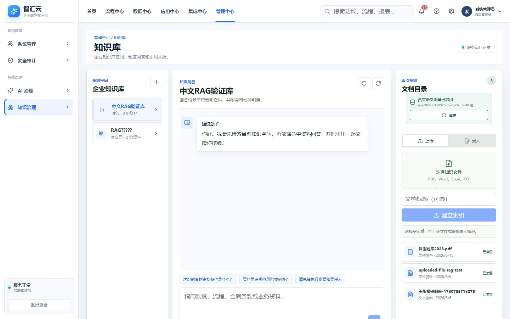
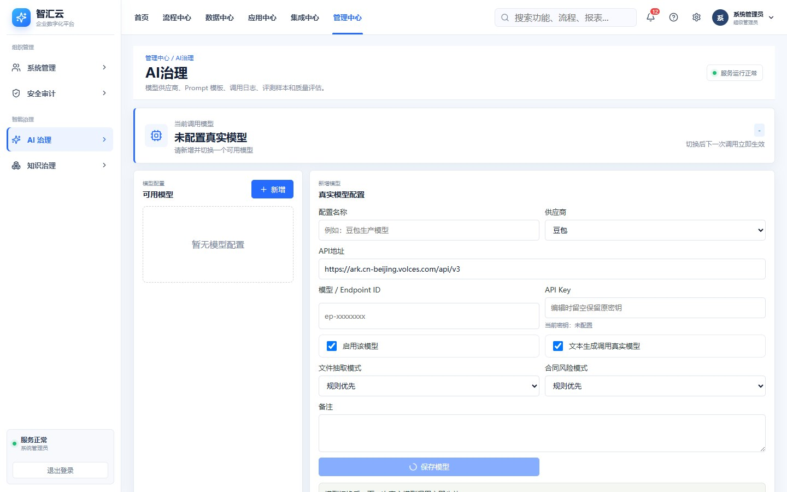
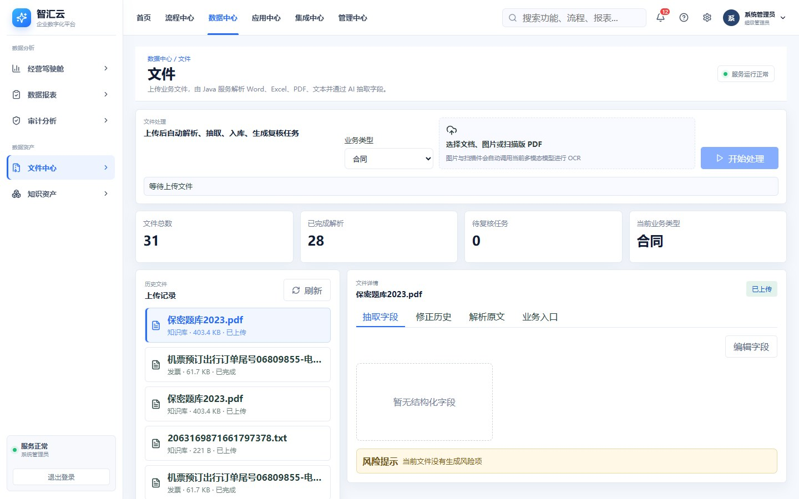
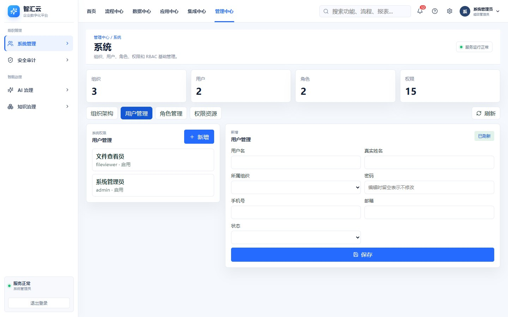
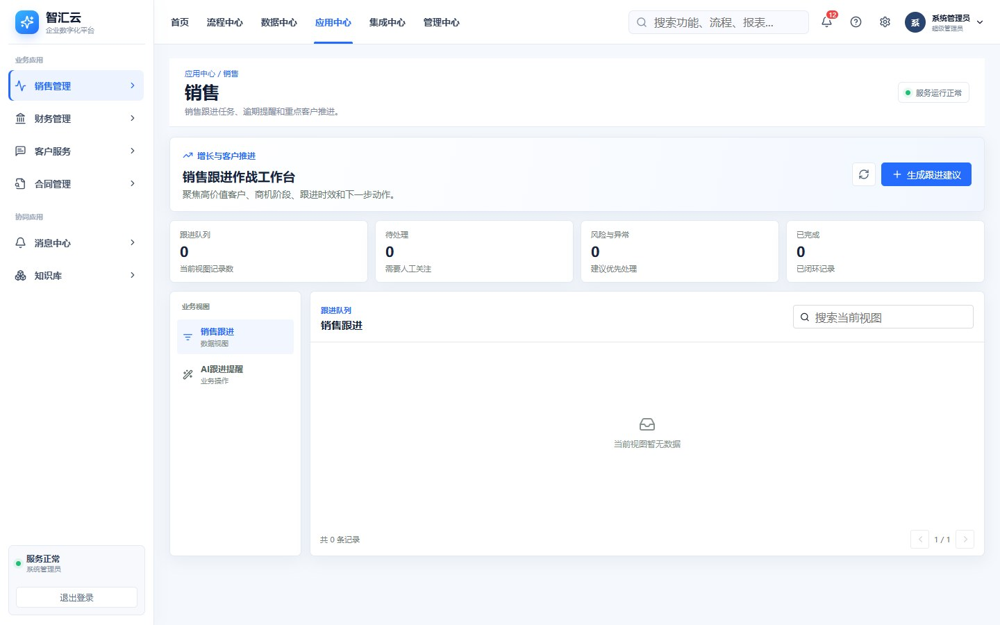

# 企业流程自动化与 AI 经营助手

这是一个面向企业日常运营的 Java + Vue 自动化平台。系统不是通用聊天机器人，而是围绕合同、发票、对账、客服、销售、知识库、报表、审批与审计等业务流程，帮助企业直接减少人工处理时间。

## 当前架构

项目当前由两个应用组成：

- `backend-java`：Java 21、Spring Boot 3、MyBatis-Plus，负责业务接口、权限、审批工作流、文件解析、AI 调用、知识库 RAG、审计与数据持久化。
- `frontend-web`：Vue 3、Vite、TypeScript，提供企业管理后台、老板经营助手和各业务模块专属工作台。

原 `ai-python` 服务能力已经全部迁移到 Java 并删除。系统运行不再依赖 Python 服务或 8000 端口。

| 服务 | 端口 | 说明 |
|---|---:|---|
| Java 后端 | 8080 | 业务、AI、RAG、权限和工作流接口 |
| Vue 前端 | 5173 | 企业管理界面，`/api` 代理至 Java 后端 |

## 功能截图

### 企业经营首页

顶部按首页、流程中心、数据中心、应用中心、集成中心和管理中心划分业务域；左侧根据当前业务中心展示分组菜单与功能入口。首页集成老板经营问答、关键指标、快捷操作和业务数据视图。



### 审批流程中心

集中查看审批待办、运行中流程、已通过实例和流程模板，支持快速发起与处理业务审批。



### 可拖拽审批流程

通过拖拽编排人工审批、部门审批、财务审批和可自动执行的 AI 复核节点。



### 企业知识库 RAG

提供知识空间、对话式知识问答、文档上传、真实 Embedding、Milvus 向量索引和引用来源展示。



### 多模型 AI 治理

支持维护多个真实模型、动态切换当前模型、配置场景路由与备用模型，并查看模型状态、效果评估和调用日志。



### 文件 AI 处理闭环

上传合同、发票、图片或扫描 PDF 后，完成 OCR、文本解析、模型字段抽取、业务入库、人工复核和审批发起。



### 企业权限管理

提供组织、用户、角色、权限资源和安全审计管理，支撑完整 RBAC 权限控制。



### 业务专属工作台

销售、财务、客服、合同等业务模块拥有独立工作台，并与 AI 建议、提醒和业务闭环协同。



## 最近完成功能

### Java AI 能力迁移

- Java 直接调用豆包等 OpenAI 兼容大模型。
- AI 配置可在前端 AI 治理页面维护，支持保存多个真实模型并随时切换。
- AI 治理页面明确展示当前使用模型、供应商、模型或 Endpoint ID、最近调用状态和降级原因。
- 模型切换后，老板问答、文件抽取和知识问答等下一次真实模型调用立即生效，无需重启服务。
- 原有单模型配置会自动迁移到多模型配置中心，已有 API Key 和运行策略不会丢失。
- 老板经营问答先查询 MySQL，再由模型组织答案。
- 文件解析、字段抽取、销售建议、对账分析、复核建议、知识问答和报表生成均由 Java 完成。
- 模型不可用时自动降级，并记录 AI 调用日志与失败原因。

### 多真实模型管理

- 支持豆包、OpenAI 兼容接口、本地模型网关和模拟模型。
- 每个模型配置独立维护配置名称、API 地址、API Key、模型或 Endpoint ID、启用状态和业务策略。
- 支持新增、编辑、删除非当前模型，以及将已启用模型切换为当前模型。
- 当前使用模型不能直接删除，避免业务调用失去可用配置。
- API Key 仅在服务端配置文件中保存，页面和查询接口只返回脱敏密钥。
- Java 模型网关每次调用前读取当前模型配置，确保切换实时生效。

#### 多模型管理接口

| 接口 | 功能 |
|---|---|
| `GET /api/ai-governance/model-profiles` | 查询全部模型配置和当前模型 |
| `POST /api/ai-governance/model-profiles` | 新增或更新模型配置 |
| `POST /api/ai-governance/model-profiles/{id}/switch` | 切换当前使用模型 |
| `DELETE /api/ai-governance/model-profiles/{id}` | 删除非当前模型配置 |
| `GET /api/ai-governance/runtime-status` | 查询当前模型和最近调用状态 |
| `GET /api/ai-governance/model-call-logs` | 查询模型调用日志 |

### AI 效果评估中心

- AI 治理页面提供基于真实业务数据的效果评估中心，支持查看最近 `7` 天、`30` 天、`90` 天或全部数据。
- 实时统计模型调用总量、成功率、失败次数、平均耗时和累计 Token。
- 按模型和业务场景对比调用量、成功率、平均耗时和 Token，便于定位效果或稳定性问题。
- 根据字段修正历史展示高频人工修正字段、影响文件数和影响业务记录数；当前采用修正频次口径，不会将未经人工确认的数据误标为字段准确率。
- 汇总字段修正批次、人工复核任务、有效反馈样本、AI 自动通过和转人工次数，展示模型输出进入业务后的反馈闭环。
- 评估数据直接聚合 `ai_model_call_log`、`field_correction_history`、`review_task` 和 `workflow_action_log`，无需额外维护统计表。

#### AI 效果评估接口

| 接口 | 功能 |
|---|---|
| `GET /api/ai-governance/evaluation-dashboard?days=30` | 查询指定时间范围内的 AI 效果评估指标 |

### 场景模型路由与备用模型切换

- AI 治理页面可为老板问答、文件抽取、OCR、知识问答、工作流 AI 复核、客服分类、对账分析、复核建议、报表生成和销售跟进等场景分别配置主模型。
- 每个场景可按顺序配置多个备用模型；主模型连接失败、超时、返回空内容或返回无效 JSON 时，Java 统一模型网关会自动尝试下一个备用模型。
- 未配置独立路由的场景继续使用“当前默认模型”，兼容原有多模型切换逻辑和历史配置文件。
- 最近一次实际使用的模型及自动切换原因会通过运行状态返回，业务调用日志记录最终成功处理请求的模型。
- 路由配置区域采用稳定双列布局；场景路由或备用模型数量增加时在各自列表内滚动，长模型名称自动换行，不会挤压或拉伸配置列。

#### 场景模型路由接口

| 接口 | 功能 |
|---|---|
| `GET /api/ai-governance/scenario-routes` | 查询全部场景模型路由 |
| `POST /api/ai-governance/scenario-routes` | 保存场景主模型及备用模型顺序 |
| `DELETE /api/ai-governance/scenario-routes/{scenario}` | 删除场景路由并恢复使用当前默认模型 |

### 文件处理闭环

- 支持 PDF、Word、Excel、JSON、CSV、文本文件以及 PNG、JPG、JPEG、BMP、WebP、TIFF 图片解析。
- 图片文件直接调用当前启用的真实多模态模型进行 OCR；扫描版 PDF 在原生文本不足时自动由 PDFBox 逐页渲染并触发 OCR。
- 文本型 PDF 保持原生快速解析，不产生额外模型调用；扫描 PDF 默认最多识别前 `10` 页，避免超大文件造成不可控调用。
- OCR 识别结果继续进入合同、发票和对账单字段抽取、业务入库、人工复核及审批流程，不形成独立数据孤岛。
- OCR 引擎会保存到 `doc_parse_result.ocr_engine`，文件详情展示“图片 OCR / 扫描 PDF OCR / 原生文本解析”，模型调用日志使用 `document_ocr` 场景记录成功或失败。
- 支持合同、发票、对账单等业务字段抽取。
- 文件处理结果统一展示，重新查询后保持相同详情结构。
- 支持重复上传同一张发票。
- 支持字段人工修正、修正原因、修正历史和审计日志。
- 文件处理后可自动创建复核任务和审批流程。

### AI 业务应用闭环

- 客服工单分类已接入真实大模型，模型输出的分类、优先级、情绪、建议处理角色和回复建议会分别写入工单及回复建议记录；模型失败时使用保守规则结果。
- 财务对账由 Java 计算金额与差异状态，大模型只负责解释差异、识别风险和生成核对建议；分析摘要会写入对账明细。
- 人工复核任务创建时会调用真实模型生成复核原因、检查清单和置信度，AI 建议随复核任务保存并返回前端，最终决定仍由人工完成。
- 人工完成复核时会同时保留原始 AI 建议和人工最终结论，为后续统计模型建议采纳率及构建评测样本提供数据基础。
- 日报、周报和经营报告基于 Java 查询的真实数据库上下文调用大模型生成，模型摘要、正文、章节和数据来源会写入报表记录。
- 客服分类、对账分析、复核建议和报表生成均记录独立模型调用日志；真实模型不可用或返回格式无效时自动降级，不阻塞业务入库。

### 权限与审批

- JWT 登录认证。
- 用户、角色、权限、组织和 RBAC 管理。
- 按模块控制接口与菜单访问权限。
- 支持审批流程定义、流程实例、任务处理、通过、驳回、转交和审批历史。
- 流程设计已改为可拖拽画布，可从节点组件区点击或拖入人工审批、部门审批、财务审批和 AI 复核节点。
- 节点组件库支持新增自定义组件，可配置组件名称、用途说明以及人工处理或 AI 自动复核执行方式。
- 自定义节点组件已保存到 MySQL 企业共享组件库，可供不同用户和浏览器重复使用；删除组件不会影响画布中已使用的节点。
- 设计器内置会签审批、并行审批、抄送节点和条件节点；会签等待全部处理人通过，并行审批支持任一处理人通过后继续流转。
- 条件节点支持基于流程变量执行等于、不等于、包含和数字大小比较，不满足条件的节点会自动跳过。
- 画布中的节点可拖拽调整顺序，节点排列顺序即审批实际流转顺序。
- 支持在属性面板维护节点名称、节点编码、处理时限和指定审批人，并可载入历史流程版本继续设计。
- 支持保存共享草稿、复制已有流程、当前版本与上一版本节点差异对比、发布前完整校验和新版本发布。
- 运行中的流程支持催办和发起人撤回，动作会进入审批轨迹和审计日志。
- 发布流程会创建新版本，生成的节点定义继续兼容 Java 后端现有 `definitionJson.nodes` 执行格式。
- AI 复核节点已接入真实大模型执行，不再只是流程画布中的展示节点。
- 流程进入 AI 复核节点后，会携带流程变量及关联合同或发票业务数据调用当前启用模型。
- 只有真实模型明确返回通过、置信度不低于 `0.85` 且未发现风险时才自动流转；模型失败、返回格式异常、低置信度或存在风险时自动转为人工待办。
- AI 复核结论、模型名称、置信度、风险和降级原因会保存到流程任务结果，并展示在审批详情及流程轨迹中。
- 每次工作流 AI 复核均记录到模型调用日志，场景标识为 `workflow_ai_review`，便于现场追踪模型效果和异常。
- 审批结果可回写合同、发票等业务记录。

### 前端专属工作台

- 前端已参考白蓝企业数字化平台重新设计，统一顶部业务中心、左侧分组菜单、业务工作台、列表、详情抽屉、表单与对话页面的视觉语言。
- 顶部菜单按首页、流程中心、数据中心、应用中心、集成中心和管理中心划分；左侧根据当前中心展示二级业务分组和三级功能入口，并继续应用 RBAC 权限过滤。
- 老板经营助手使用连续对话界面。
- 文件、AI 治理、权限管理、审批流程和知识库均拥有专属页面。
- 各业务字段使用中文标签展示。
- 前端仅调用真实 Java 后端接口。
- 采用紧凑企业后台布局，使用分组导航、业务视图标签、搜索列表和分页。
- 通用业务列表点击行后使用右侧详情抽屉展示，不再直接显示接口返回 JSON。
- 详情抽屉使用中文字段名，并隐藏逻辑删除、存储路径和组织 ID 等内部控制字段。
- 精简检查服务、加载数据和重复刷新等技术型按钮，仅保留查询、提交、审批和必要刷新操作。
- 文件页面使用上传、历史文件和业务详情主从布局；知识库页面使用知识空间、连续对话和文档目录三栏布局。
- 审批流程页面提供节点组件区、可拖拽流程画布和节点属性面板，并针对窄屏自动切换为单列布局。
- 移动端使用横向模块导航，避免导航菜单占满首屏。

## 知识库 RAG

知识库已经实现完整 Java RAG 闭环，不再返回固定答案。

### 知识入库

- 创建带权限范围的知识库空间，支持全公司、法务、财务和销售范围。
- 支持直接录入制度、流程说明和业务知识文本。
- 支持上传 PDF、Word、Excel、TXT 等知识文件。
- Java 自动解析文本、生成重叠切片并建立向量索引。

### 向量检索

- 使用豆包真实 Embedding 接入点 `ep-20260615092553-lqvch` 生成 `2048` 维语义向量。
- 使用 Milvus Standalone 保存真实向量并执行 COSINE Top-K 检索。
- Embedding API地址、API Key、接入点ID、向量维度、Milvus地址和集合名称均在AI治理页面维护，并持久化到MySQL `ai_embedding_config`，不写入应用配置文件。
- AI治理页面提供Embedding真实连接测试和最近100条专属调用日志，知识入库、问题检索和连接测试均可追踪。
- MySQL `kb_chunk` 继续保存知识切片、引用关系、Embedding模型和Milvus向量引用，保证业务数据可追踪。
- 可查看命中文档、原始知识片段和相似度。
- Milvus或豆包Embedding暂时不可用时，自动降级到Java本地哈希向量检索，知识问答不会完全中断。
- 知识库页面展示真实向量链路状态，并支持将历史知识切片一键重建到Milvus。

### 知识问答

- 前端知识库页面使用真正的连续对话界面。
- 每次问答先检索当前权限范围内的知识切片。
- 豆包仅根据检索资料组织答案，资料不足时提示人工确认。
- 回答返回 `[1]` 格式引用、置信度和命中知识片段。
- 切换知识空间后自动重置对话上下文。

### 知识库接口

| 接口 | 功能 |
|---|---|
| `GET /api/kb/spaces` | 查询知识空间 |
| `POST /api/kb/spaces` | 创建知识空间 |
| `GET /api/kb/documents` | 查询已索引文档 |
| `POST /api/kb/documents/text` | 录入文本并建立索引 |
| `POST /api/kb/documents/file` | 上传文件并建立索引 |
| `GET /api/kb/search` | 查看 Top-K 知识切片 |
| `POST /api/kb/query` | 基于检索上下文进行知识问答 |
| `GET /api/kb/vector-status` | 查询豆包Embedding与Milvus运行状态 |
| `POST /api/kb/vectors/reindex` | 将历史知识切片重建为真实语义向量 |
| `GET /api/ai-governance/embedding-config` | 查询脱敏的Embedding与Milvus配置 |
| `POST /api/ai-governance/embedding-config` | 保存Embedding与Milvus配置 |
| `POST /api/ai-governance/embedding-config/test` | 执行真实Embedding与Milvus连接测试 |
| `GET /api/ai-governance/embedding-logs` | 查询Embedding专属调用日志 |

## 环境与启动

- JDK：`D:\kfhj\jdk\jdk-21.0.11`
- Maven：`D:\kfhj\maven\apache-maven-3.9.16`
- Maven 本地仓库：`D:\kfhj\maven\mavenqiye`
- MySQL：`localhost:3306/qyglai`

### 1. 启动 Java 后端

打开第一个 PowerShell 终端：

```powershell
cd E:\xm\qyglai\backend-java
$env:JAVA_HOME='D:\kfhj\jdk\jdk-21.0.11'
$env:Path="$env:JAVA_HOME\bin;D:\kfhj\maven\apache-maven-3.9.16\bin;$env:Path"
mvn "-Dmaven.repo.local=D:\kfhj\maven\mavenqiye" spring-boot:run
```

后端启动成功后可访问：

- 健康检查：`http://localhost:8080/actuator/health`
- Swagger API 文档：`http://localhost:8080/swagger-ui/index.html`
- Swagger 已为全部接口提供中文模块分组、中文接口名称和中文功能说明。
- Java 后端核心业务链路已补充中文代码注释，重点说明主要方法职责、跨服务调用、模型降级、数据落库、审批流转与复杂代码块的设计意图。

### 2. 启动 Vue 前端

打开第二个 PowerShell 终端：

```powershell
cd E:\xm\qyglai\frontend-web
npm install
npm run dev
```

`npm install` 仅在首次运行或依赖发生变化时执行，后续直接运行 `npm run dev`。

### 3. 登录系统

- 前端访问地址：`http://localhost:5173`
- 默认管理员账号：`admin`
- 默认管理员密码：`123456`

停止前端或后端服务时，在对应终端按 `Ctrl + C`。

## 数据与配置

- MySQL 初始化脚本：`database/mysql/qyglai.sql`
- 后端配置：`backend-java/src/main/resources/application.yml`
- 多模型运行配置：`backend-java/runtime/model_profiles.json`
- 旧单模型配置：`backend-java/runtime/model_config.json`，首次使用多模型功能时自动迁移
- 上传文件目录：`backend-java/storage/uploads`

AI 模型配置文件已加入 `.gitignore`，不要提交真实 API Key。新增多模型接口后需要重新构建并重启 Java 后端，否则前端保存模型时会提示找不到 `/api/ai-governance/model-profiles`。

## 后端控制台日志

- Java 后端输出应用启动、数据库连接和 Spring 运行日志。
- MyBatis-Plus SQL、参数和查询结果会输出到 IDEA Run 控制台。
- 每个 `/api/**` 请求输出请求方法、路径、状态码、耗时、当前用户、客户端 IP 和 `traceId`。
- 参数校验、权限异常和未处理异常会输出日志，其中服务端异常包含完整堆栈。
- 日志不会主动打印密码、JWT Token、API Key 或请求正文。

## 基础设施

- MyBatis-Plus：业务数据持久化。
- Redis：客户端已集成，默认关闭实际读写。
- Kafka：客户端已集成，默认关闭事件投递。
- Spring Security：JWT 与 RBAC 权限控制。
- Springdoc OpenAPI：接口文档。
- MySQL：业务数据、知识切片、引用关系和向量元数据存储。
- 豆包 Embedding：生成真实语义向量，当前接入点为 `ep-20260615092553-lqvch`。
- Milvus：保存知识向量并执行高性能语义相似度检索，默认地址 `localhost:19530`。
- Embedding配置表：MySQL `ai_embedding_config`，由AI治理页面维护并即时生效。

## 业务专属工作台

- 合同、财务、客服、销售、报表、复核、消息、集成和审计模块已从通用接口列表升级为业务专属工作台。
- 每个工作台根据业务语义展示独立标题、说明、关键指标、待处理数量、风险异常数量和金额或闭环统计。
- 左侧业务视图用于切换台账、批次、明细和操作场景；业务操作表单与数据列表分离，避免列表页面堆叠无关按钮。
- 合同工作台聚焦履约与风险，财务工作台聚焦票据与对账，客服工作台聚焦服务队列，销售工作台聚焦客户跟进。
- 报表、消息、集成和审计工作台分别面向档案生成、触达记录、系统事件和合规轨迹。
- 业务详情使用统一档案抽屉展示，但标题、摘要和指标随模块变化；移动端自动切换为单列布局。

## AI 健康检查与智能治理建议

- AI 治理页面新增模型连接健康检查，可一次检查全部已启用真实模型。
- 健康检查通过最小真实模型请求验证 API 地址、密钥和 Endpoint ID 是否可用，并记录状态、耗时、说明和检查时间。
- 最近 5 分钟健康状态会参与 Java 模型网关自动路由：健康模型优先，近期不可用模型自动后置，未检查时保持用户配置的主备顺序。
- AI 效果评估中心会根据真实调用成功率、平均耗时、场景稳定性、模型表现、字段修正和人工复核闭环自动生成治理建议。
- 治理建议会指出需要检查的模型或场景，并给出配置备用模型、优化提示词、处理复核队列等具体动作。

### 模型健康检查接口

| 接口 | 功能 |
|---|---|
| `GET /api/ai-governance/model-health` | 查询全部模型最近健康状态 |
| `POST /api/ai-governance/model-health/check-all` | 检查全部已启用模型 |
| `POST /api/ai-governance/model-profiles/{id}/health-check` | 检查指定模型 |
